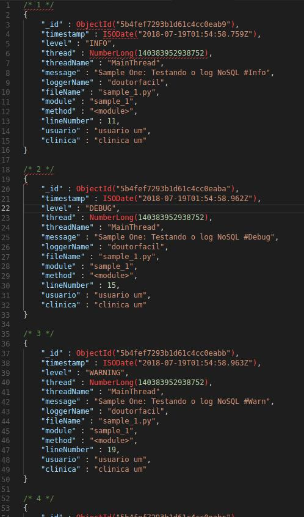
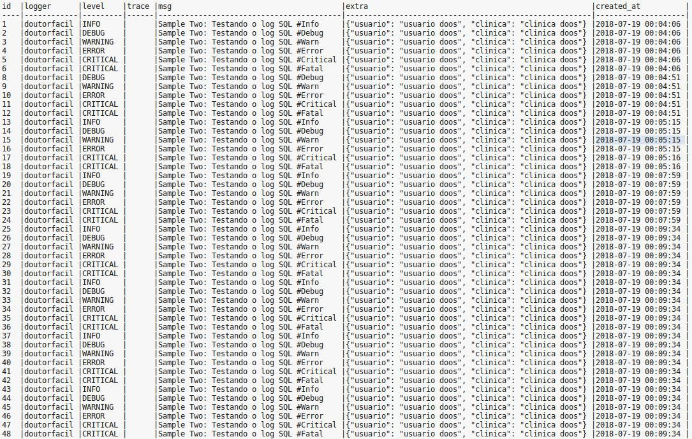

# Criação de logs usando banco relacional e não relacional
Teste de estresse feito com 1.000 entradas de logs.

## NoSQL - MongoDB
```sh
$ time python sample_nosql.py
```
Resultado dos logs salvos em um banco não relacional: 4.586468696594238 segundos

python sample_nosql.py  3,66s user 0,25s system 74% cpu 5,265 total




## SQL - PostgreSQL
```sh
$ time python sample_sql.py
```
Resultado dos logs salvos em um banco relacional: 82.4825050830841 segundos

python sample_sql.py  13,05s user 1,03s system 16% cpu 1:22,97 total

